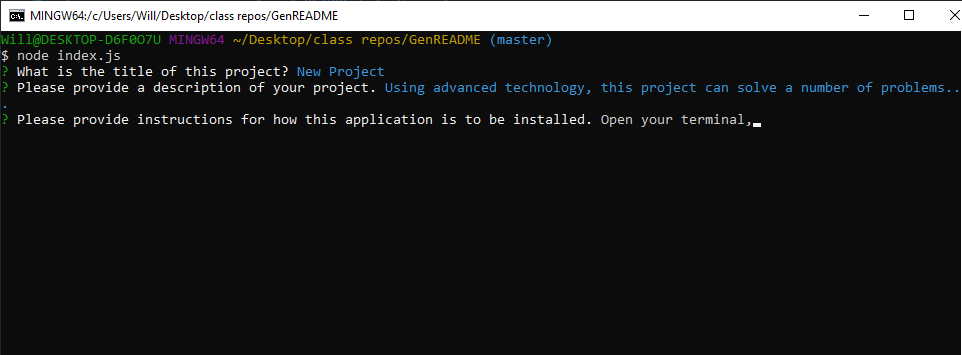

# README File Generator

## Description

This is a program that will return an organized README file for your project 
based off of inputed information from your node inquirer prompts. 

### Technology Used

Node.js, Javascript, Inquirer 

### Visuals

### Links
Github Repository:
[githubRepository]  https://github.com/will98nicholson/READMEgenerator
Video Walkthough:
[videoWalkthough]  https://drive.google.com/file/d/1FF6-UWp2n0ylsGPsiheWFYOzM6UeMHuG/view